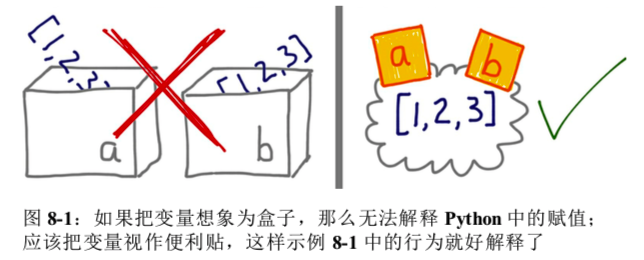

# 对象特性

## 变量不是盒子



对于 Python 的赋值语句，应该始终先读右边。对象在右边创建或获取，在此之后左边的变量才会绑定到对象上。就像对对象贴上标签。绑定多个变量无非就是贴的多而已。

```python
>>> charles = {'name': 'Charles L. Dodgson', 'born': 1832}
>>> lewis = charles

>>> lewis is charles
True

>>> id(charles), id(lewis)
(4384875936, 4384875936)

>>> lewis['balance'] = 950
>>> charles
{'name': 'Charles L. Dodgson', 'born': 1832, 'balance': 950}

# 有一种情况内容是一样的，但是不是同一个东西
>>> alex = {'name': 'Charles L. Dodgson', 'born': 1832, 'balance': 950}

>>> charles == alex	# 比较结构是因为 dict 类中的 __eq__ 方法就是这样实现的。
True
>>> charles is not alex
True

# 每个变量都有标识、类型和值。对象一旦创建，它的标识绝不会变；可以把标识理解为对象在内存中的地址。is 运算符比较两个对象的标识；id() 函数返回对象标识的整数表示
# id() 在 CPython 中返回对象的内存地址，但是在其他 Python 解释器中可能是别的值。关键在于 ID 一定是唯一的数值标注，而且在对象的生命周期中绝不会变。
```

### 在 `==` 和 `is` 之间选择

`==` 运算符比较两个对象的值（对象中保存的数据），而 `is` 比较对象的标识。

然而，在变量和单例值之间比较时，应该使用 `is` 

```python
x is None
x is not None
```

`is` 运算符比 `==` 速度快，因为它不能重载。而 a == b 是语法糖，等同于 `a.__eq__(b)` 

### 元组的相对不可变性

元组与多数 Python 集合（列表、字典、集、等等）一样，保存的是对象的引用。如果引用的对象是可变的，即便元组本身不可变，元素依然可变。也就是说，元组的不可变性其实是指 `tuple` 数据结构的物理内容（即保存的引用）不可变，与引用的对象无关。

### 浅复制（默认）

复制列表（或多数内置的可变集合）最简单的方式是使用内置的类型构造方法。

```python
>>> l1 = [3, [55, 44], (7, 8, 9)]
>>> l2 = list(l1)
>>> l2
[3, [55, 44], (7, 8, 9)]
>>> l1 == l2
True
>>> l1 is l2
False
# 对列表和其他可变序列来说，可以直接用切片创建副本
l2 = l1[:]
```

### 对对象做深复制和浅复制

```python
>>> import copy
>>> obj = object()
>>> obj1 = obj.copy()
>>> obj2 = obj.deepcopy()
```

## 函数参数特性

Python 唯一支持的参数传递模式是共享传参（call by sharing）

共享传参指函数的各个形式参数获得实参中各个引用的副本。也就是说，函数内部的形参是实参的别名。

这种方案结果：函数可能会修改作为参数传入的可变对象。

### 不要使用可变类型作为参数的默认值

### 防御可变参数

如果定义的函数接收可变参数，应该谨慎考虑调用方是否期望修改传入的参数

```python
def __init__(self, passengers=None):
    if passengers is None:
        self.passengers = []
    else:
        self.passengers = list(passengers)
```

## `del` 和垃圾回收

`del` 语句删除名称，而不是对象。`del` 命令可能会导致对象被当作垃圾回收，但是仅当删除的变量保存的是对象的最后一个引用，或者无法得到对象时。

在 CPython 中，垃圾回收使用的主要算法是引用计数。实际上，每个对象都会统计有多少引用指向自己。当引用计数归零时，对象立即就被销毁：CPython 对在对象上调用 `__del__` 方法（如果有定义了），然后释放分配给对象的内存。Python 的其他实现有更复杂的垃圾回收程序，而且不依赖引用计数。

## 弱引用

有时候需要引用对象，而不让对象存在的时间超过所需时间。经常用在缓存中。

弱引用不会增加对象的引用数量。引用的目标对象称为所指对象（referent）。

弱引用在缓存应用中很有用，因为我们不想仅因为被缓存引用着而始终保存缓存对象。

## `WeakValueDictionary`

`WeakValueDictionary` 类实现的是一种可变映射，里面的值是对象的弱引用。被引用的对象在程序中的其他地方被当作垃圾回收后，对应的键会自动从 `WeakValueDictionary` 中删除。因此，`WeakValueDictionary` 经常用于缓存。

