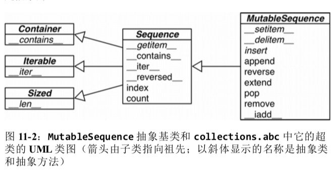
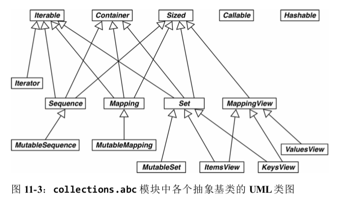
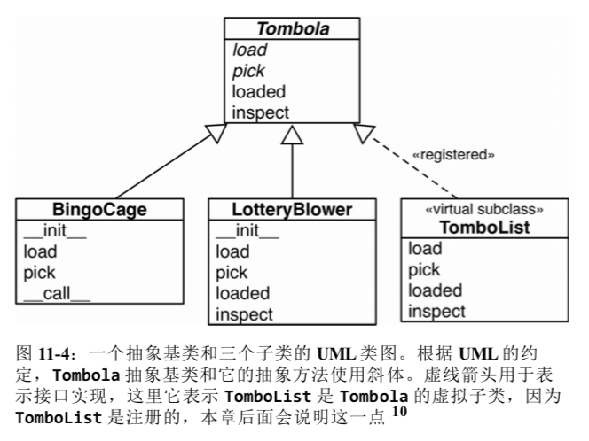
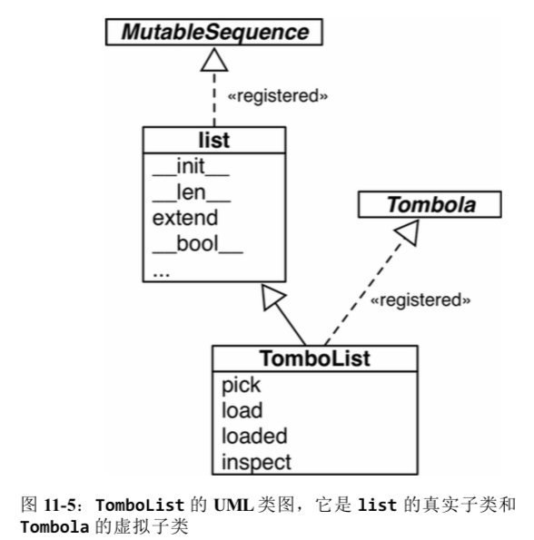

# 接口

“鸭子类型”（即忽略对象的真正类型，转而关注对象有没有实现所需的方法、签名和语义）。

在近代，属和种基本上是根据表征系统学（phenetics）分类的。表征学关注的是形态和举止的相似性。然而，平行进化往往会导致不相关的种产生相似的特征，形态和举止方面都是如此，但是生态位的相似性是偶然的，不同的种仍属不同的生态位。

```python
# 编程语言也有这种“偶然的相似性”
class Artist:
    def draw(self): ...

class Gunslinger:
    def draw(self): ...
        
class Lottery:
    def draw(self): ...
```

反正就是参照生物学的一些分类方法。比如在表征学之外再使用支序系统学（cladistics）来表达。

参照水禽的分类学演化，在鸭子类型的基础上增加白鹅类型（goose typing）

白鹅类型指，只要 `cls` 是抽象基类，即 `cls` 的元类是 `abc.ABCMeta`，就可以使用 `isinstance(obj, cls)`

`collections.abc` 中有很多有用的抽象类（Python 标准库的 `numbers` 模块中还有一些）。

```python
>>> class Struggle:
...     def __len__(self): return 23

>>> from collections import abc
>>> isinstance(Struggle(), abc.Sized)
True
# 无需注册，abc.Sized 也能把 Struggle 识别为自己的子类，只要实现了特殊方法 __len__ 即可。
```

## 定义抽象基类的子类

```python
import collections

Card = collections.namedtuple('Card', ['rank', 'suit'])
class FrenchDeck2(collecitons.MutableSequence):
    ranks = [str(n) for n in range(2, 11)] + list('JQKA')
    suits = 'spades diamonds clubs hearts'.split()
    
    def __init__(self):
        self._cards = [Card(rank, suit) for suit in self.suits
                      					for rank in self.ranks]
        
    def __len__(self):
        return len(self._cards)
    
    def __getitem__(self, position):
        return self._cards[position]
    
    def __setitem__(self, position, value):	# 支持洗牌。random.shuffle
        self._cards[position] = value
        
    def __delitem__(self, position):	# MutablSequence 的抽象方法，
        del self._cards[position]
        
    def insert(self, position, value):	# MutablSequence 的抽象方法，
        self._cards.insert(position, value)

# 在导入时（加载并编译 frenchdeck2.py 模块时），Python 不会检查抽象方法的实现。在运行时实例化 FrenchDeck2 类时才会真正检查。如果没有正确实现某个抽象方法， Python 会抛出 TypeError 异常。
# FrenchDeck2 从 Sequence 继承了几个拿来即用的具体方法：__contains__ __iter__ __reversed__... 从 MutableSequence 继承了 append extend pop...
```



## 标准库中的抽象基类

标准库中提供了抽象基类。大多数抽象基类在 `collections.abc` 模块中定义，但在 `numbers`、`io` 等包中也有。只是 `abc` 中的抽象基类最常用

### `collections.abc`



#### `Iterable`、`Container` 和 `Sized`

各个集合应该继承这三个抽象基类，或者至少实现兼容的协议。`Iterable` 通过 `__iter__` 方法支持迭代，`Container` 通过 `__contains__` 方法支持 `in` 运算符，`Sized` 通过 `__len__` 方法支持 `len()` 函数。

#### `Sequence` 、`Mapping` 和 `Set`

这三个是主要的不可变集合类型，或者至少实现兼容的协议。而且各自都有可变的子类。

#### `MappingView`

在 Python3 中，映射方法 `.items()`、`.keys()` 和 `.values()` 返回的对象分别是 `ItemsView`、`KeysView` 和 `ValuesView` 的实例。前两个类还从 `Set` 类继承了丰富的接口。

#### `Callable` 和 `Hashable`

这两个抽象基类的主要作用是为内置函数 `isinstance` 提供支持，以一种安全的方式判断对象能不能调用或散列。

如果想检查是否能调用，可以使用内置的 `callable()` 函数；但是没有类似的 `hashable()` 函数，因此测试对象是否可散列，最好使用 `isinstance(my_obj, Hashable)`

#### `Iterator`

是 `Iterable` 的子类。

### `numbers`

numbers 包定义的是“数字塔”（即各个抽象基类的层次结构是线性的），其中 `Number` 是位于最顶端的超类，随后是 `Complex` 子类 。依次往下，最底端是 `Integral`

- Number
- Complex
- Real
- Rational
- Integral

因此，如果想检查一个数是不是整数，可以使用 `isinstance(x, numbers.Integral)` ，这样代码就能接受 `int`、`bool`（`int` 的子类），或者外部库使用 `numbers` 抽象基类注册的其他类型。为了满足检查的需要，你或者你的 API 用户始终可以把兼容的类型注册为 `numbers.Integral` 的虚拟子类。

与之类似，如果一个值是浮点数类型，可以使用 `isinstance(x, numbers.Real)` 检查。这样代码就能接受 `bool` 、`int`、`float`、`fractions.Fraction`，或者外部库（如 NumPy，它做了相应的注册）提供的非复数类型。

## 定义并使用一个基类

设计一抽象基类（Tombola）：

其中有四个方法，两个是抽象方法：

- `.load(...)` 把元素放入容器。（抽象）
- `.pick()` 从容器中随机拿出一个元素，返回选中的元素。（抽象）
- `.loaded()` 如果容器中至少有一个元素，返回 True
- `.inspect()` 返回一个有序元组，由容器中的现有元素构成，不会修改容器的内容。



```python
import abc


class Tombola(abc.ABC):
    @abc.abstractmethod
    def pick(self):
        """
        随机删除元素并返回
        实例为空时应抛出 `LookupError`
        """

    @abc.abstractmethod
    def load(self, iterable):
        """
        从可迭代对象中添加元素
        """

    def loaded(self):
        """
        如果不为空，返回 `True`
        """
        return bool(self.inspect())

    def inspect(self):
        """
        返回一个有序元组，由当前元素构成
        """
        items = []
        while True:
            try:
                items.append(self.pick())
            except LookupError:	# 是 IndexError、KeyError 的超类
                break
        self.load(items)	# 放回去
        return tuple(sorted(items))
```

### 抽象基类句法详解

声明抽象基类最简单的方式是继承 `abc.ABC` 或其他抽象基类。

`abc.ABC` 是 Python 3.4 新增的类。如果使用的是旧版 Python，则：

```python
class Tombola(metaclass=abc.ABCMeta):
	# ...
    
# Python 2 中
class Tombola(object):
    __metaclass__ = abc.ABCMeta
    # ...
```

基于 Tombola 就可以开发两个具体子类：

```python
import random

class BingoCage(Tombola):
    
    def __init__(self, items):
        self._randomizer = random.SystemRandom()
        self._items = []
        self.load(items)
        
    def load(self, items):
        self._items.extend(items)
        self._randomizer.shuffle(self._items)
        
    def pick(self):
        try:
            return self._items.pop()
        except IndexError:
            raise LookupError('pick from empty BingoCage')
            
   	def __call__(self):
        self.pick()
```

```python
import random

class LotteryBlower(Tombola):
    
    def __init__(self, iterable):
        self._balls = list(iterable)
        
    def load(self, iterable):
        self._balls.extend(iterable)
        
    def pick(self):
        try:
            position = random.randrange(len(self._balls))
        except ValueError:
            raise LookupError('pick from empty LotteryBlower')
        return self._balls.pop(position)
    
    def loaded(self):
        return bool(self._balls)
    
    def inspect(self):
        return tuple(sorted(self._balls))
```

### 虚拟子类

不使用继承，也有办法把一个类注册为抽象基类的虚拟子类。这样做的话，我们保证注册的类忠实地实现了抽象基类定义的接口，如果我们不这么做的话。那么常规的运行时异常会把我们捕获。

注册虚拟子类的方式是在抽象基类上调用 `register` 方法。用 `issubclass` 和 `isinstance` 等函数都能识别，但是注册的类不会从抽象基类中继承任何方法或属性。



```python
>>> from random import randrange

>>> @Tombola.register
... class TomboList(list):
    
...     def pick(self):
...         if self:
...             position = randrange(len(self))
...             return self.pop(position)
...         else:
...             raise LookupError('pop from empty TomboList')

...     load = list.extend

...     def loaded(self):
    
...         return bool(self)

...     def inspect(self):
...         return tuple(sorted(self))
```

