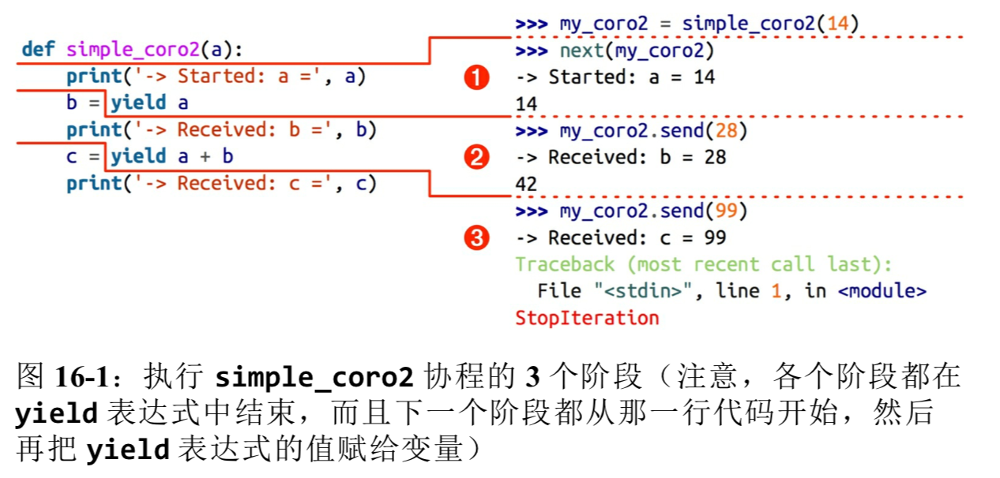

# 协程

## 生成器 to 协程

在 Python 2.5 后，yield 关键字可以在表达式中使用，而且生成器 API 中增加了 `.send(value)` 方法。生成器的调用方可以使用 `.send(...)` 发送数据，发送的数据会成为生成器函数中 yield 表达式的值。因此，生成器可以作为协程使用。协程是指一个过程，这个过程与调用方协作，产出由调用方提供的值。

`.throw(...)` 调用方抛出异常，在生成器中处理。

`.close(...)` 中止生成器。

## 基本行为

```python
>>> def simple_coroutine():
...     print('-> coroutine started')
...     x = yield
...     print('-> coroutine received ', x)

>>> my_coro = simple_coroutine()
>>> my_coro
<generator object simple_coroutine at 0x11065de08>

>>> next(my_coro)
-> coroutine started # 产出是 None，隐式指定。

>>> my_coro.send(42)
-> coroutine received  42
Traceback (most recent call last):
  File "<stdin>", line 1, in <module>
StopIteration
# 协程定义体中的 yield 表达式会计算出 42； 现在，协程会恢复，一直运行到下一个 yield 表达式，或者终止。
```

协程有四个状态，当前状态可以使用 `inspect.getgeneratorstate(...)` 函数指定：

- 'GEN_CREATED' 等待开始执行
- 'GEN_RUNNING' 解释器正在执行
- 'GEN_SUSPENDED' 在 yield 表达式处暂停
- 'GEN_CLOSED' 执行结束

因为 send 方法的参数会成为暂停的 yield 表达式的值，所以，仅当协程处于暂停状态时才会调用 send 方法。

```python
>>> def simple_coro2(a):
...     print('-> Started: a = ', a)
...     b = yield a
...     print('-> Received: b = ', b)
...     c = yield a + b
...     print('-> Received: c = ', c)

>>> my_coro2 = simple_coro2(14)

>>> from inspect import getgeneratorstate
>>> getgeneratorstate(my_coro2)
'GEN_CREATED'

>>> next(my_coro2)
-> Started: a =  14
14

>>> getgeneratorstate(my_coro2)
'GEN_SUSPENDED'

>>> my_coro2.send(28)
-> Received: b =  28
42
# 客户端代码再激活协程时才会设定 b 的值。

>>> my_coro2.send(99)
-> Received: c =  99
Traceback (most recent call last):
  File "<stdin>", line 1, in <module>
StopIteration
```



## 使用协程计算移动平均值

```python
>>> def averager():
...     total = 0.0
...     count = 0
...     average = None
...     while True:
...         term = yield average
...         total += term
...         count += 1
...         average = total/count

>>> core_avg = averager()
>>> next(core_avg)
>>> core_avg.send(10)
10.0

>>> core_avg.send(15)
12.5
```

## 预激协程的装饰器

```python
from functools import wraps

def coroutine(func):
    @wraps(func)
    def primer(*args, **kwargs):
        gen = func(*args, **kwargs)
        next(gen)
        return gen
    return primer
```

## 控制协程

协程中未处理的异常会向上冒泡，传给 next 函数或 send 方法的调用方（即触发协程的对象）。

客户代码可以在生成器对象上调用两个方法，显式地把异常发给协程。

- `generator.throw(exc_type[, exc_value[, traceback]])`
  使生成器在暂停的 yield 表达式处抛出指定的异常。如果生成器处理了抛出的异常，代码会向前执行到下一个 yield 表达式，而产出的值会成为调用 `generator.throw` 方法得到的返回值。
- `generator.close()`
  使生成器在暂停的 yield 表达式处抛出 GeneratorExit 异常。

```python
>>> class DemoException(Exception):
...     pass

>>> def demo_exc_handling():
...     print('-> coroutine started')
...     while True:
...         try:
...             x = yield
...         except DemoException:
...             print('*** DemoException handled. Continuing...')
...         else:
...             print('-> coroutine received: {!r}'.format(x))
...     raise RuntimeError('This line should never run.')

>>> exc_coro = demo_exc_handling()

>>> next(exc_coro)
-> coroutine started

>>> exc_coro.send(10)
-> coroutine received: 10

>>> exc_coro.send(15)
-> coroutine received: 15

>>> exc_coro.close()

>>> exc_coro = demo_exc_handling()

>>> next(exc_coro)
-> coroutine started

>>> exc_coro.send(10)
-> coroutine received: 10
# 传入异常。能够处理。
>>> exc_coro.throw(DemoException)
*** DemoException handled. Continuing...

>>> exc_coro.send(10)
-> coroutine received: 10

>>> exc_coro.throw(ZeroDivisionError)
Traceback (most recent call last):
  File "<stdin>", line 1, in <module>
  File "<stdin>", line 5, in demo_exc_handling
ZeroDivisionError
>>> from inspect import getgeneratorstate

>>> getgeneratorstate(exc_coro)
'GEN_CLOSED'
# 如果无法处理传入的异常，协程会终止。所以不管协程如何结束都想做些清理工作，要把协程定义体中相关的代码放到 try/finally 块中。
```

```python
def demo_finally():
    print('-> coroutine started.')
    try:
        while True:
            try:
                x = yield
            except DemoException:
                print('...')
            else:
                print('...')
    finally:
        print('-> coroutine ending.')
```

