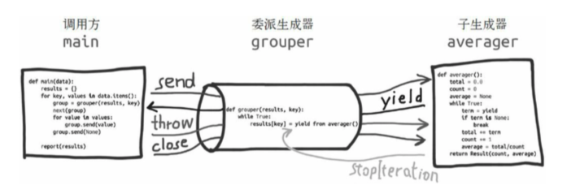

# 协程基本应用

## 让协程返回值

```python
from collections import namedtuple
Result = namedtuple('Result', 'count average')

def averager():
    total = 0.0
    count = 0
    average = None
    while True:
        term = yield
        if term is None:
            break
        total += term
        count += 1
        average = total/count
    return Result(count, average)

>>> core_avg = averager()
>>> next(core_avg)
>>> core_avg.send(10)
>>> core_avg.send(11)
>>> core_avg.send(None)
Traceback (most recent call last):
  File "<stdin>", line 1, in <module>
StopIteration: Result(count=2, average=10.5)

Result(count=2, average=10.5) # 发送哨值，产出值

>>> core_avg = averager()
>>> next(core_avg)
>>> core_avg.send(11)
>>> core_avg.send(13)
>>> try:
...     core_avg.send(None)
... except StopIteration as exc:
...     result = exc.value
>>> result
Result(count=2, average=12.0) # 捕获异常，获取返回值
```

yield from 结构会在内部自动捕获 StopIteration 异常。解释器不仅会捕获 StopIteraion 异常，还会把 value 属性的值变成 yield from 表达式的值。

## `yield from`

yield from 是全新的语言结构。在其他语言中，类似的结构使用 await 关键字。它传达了：在生成器 gen 中使用 `yield from subgen()` 时，subgen 会获得控制权，把产出的值传给 gen 的调用方，即调用方可以直接控制 subgen。与此同时，gen 会阻塞，等待 subgen 终止。

```python
>>> def gen():
...     for c in 'AB':
...         yield c
...     for i in range(1, 3):
...         yield i

>>> list(gen())
['A', 'B', 1, 2]


>>> def gen():
...     yield from 'AB'
...     yield from range(1, 3)

>>> list(gen())
['A', 'B', 1, 2]
```

- 使用 yield from 链接可迭代的对象

  ```python
  >>> def chain(*iterables):
  ...     for it in iterables:
  ...         yield from it
  
  >>> s = 'ABC'
  
  >>> t = tuple(range(3))
  
  >>> list(chain(s, t))
  ['A', 'B', 'C', 0, 1, 2]
  ```

`yield from x` 表达式对 x 对象所做的第一件事是，调用 `iter(x)` ，从中获取迭代器。因此，x 可以是任何可迭代的对象。

`yield from` 的主要功能是打开双向通道，把最外层的调用方与最内层的子生成器连接起来，这样两者可以直接发送和产出值，还可以直接传入异常，而不用在位于中间的协程中添加大量处理异常的样板代码。有了这个结构，协程可以通过以前不可能的方式委托指责。

## 使用 yield from 需要改动部分

- 委派生成器
  包含 `yield from <iterable>` 表达式的生成器函数
- 子生成器
  从 `yield from` 表达式中 `<iterable>` 部分获取的生成器。
- 调用方
  调用委派生成器的客户端代码。



```python
>>> Result = namedtuple('Result', 'count average')
# 子生成器
>>> def averager():
...     total = 0.0
...     count = 0
...     average = None
...     while True:
...         term = yield
...         if term is None:
...             break
...         total += term
...         count += 1
...         average = total/count
...     return Result(count, average) # 会成为 grouper 函数中 yield from 表达式的值。

# 委派生成器
>>> def grouper(results, key):
...     while True:
...         results[key] = yield from averager()

# 客户度代码，即调用方
>>> def main(data):
...     results = {}
...     for key, values in data.items():
...         group = grouper(results, key)
...         next(group)
...         for value in values:
...             group.send(value)
...         group.send(None)
...     report(results)

>>> def report(results):
...     for key, result in sorted(results.items()):
...         group, unit = key.split(';')
...         print('{:2} {:5} averaging {:.2f}{}'.format(result.count, group, result.average, unit))

>>> data = {
...     'girls;kg': [40.9, 38.5, 42.1, 45.2, 37.8, 39.5],
...     'girls;m': [1.6, 1.34, 1.5, 1.44, 1.42, 1.57],
...     'boys;kg': [39.0, 40.8, 43.2, 38.9, 42.9],
...     'boys;m': [1.37, 1.4, 1.46, 1.55, 1.39]
... }

>>> main(data)
```

任何 yield from 链条都必须由客户驱动，在最外层委派生成器上调用 `.next(...)` 函数或 `.send(...)` 方法。

## `yield from` 的行为

- 子生成器产出的值都直接传给委派生成器的调用方（即客户端代码）。
- 使用 `send()` 方法发给委派生成器的值都直接传给子生成器。如果发送的值是 None，那么会调用子生成器的 `__next__()` 方法。如果发送的值不是 None，那么会调用子生成器的 `send()` 方法。如果调用的方法抛出 StopIteration 异常，那么委派生成器恢复运行。任何其他异常都会向上冒泡，传给委派生成器。
- 生成器退出时，生成器（或子生成器）中的 return expr 表达式会触发 `StopIteration(expr)` 异常抛出。
- yield from 表达式的值是子生成器终止时传给 StopIteration 异常的第一个参数。
- 传入委派生成器的异常，除了 GeneratorExit 之外都传给子生成器的 throw() 方法。如果调用 throw() 方法时抛出 StopIteration 异常，委派生成器恢复运行。StopIteration 之外的异常会向上冒泡，传给委派生成器。
- 如果把 GeneratorExit 异常传入委派生成器，或者在委派生成器上调用 close() 方法，那么在子生成器上调用 close() 方法，如果它有的话。如果调用过程抛出异常，那么异常会向上冒泡，传给委派生成器；否则，委派生成器抛出 GeneratorExit 异常。

```python
-> RESULT = yield from EXPR 简化
_i = iter(EXPR)
try:
    _y = next(_i)
except StopIteration as _e:
    _r = _e.value
else:
    while 1:
        _s = yield _y
        # 产出子生成器当前产出的元素；等待调用方发送 _s 中保存的值。
        try:
            _y = _i.send(_s)
            # 尝试让子生成器向前执行，转发调用方发送的 _s
        except StopIteration as _e:
            _r = _e.value
            break
RESULT = _r

-> 处理 throw() 和 close() 的改进
_i = iter(EXPR)
try:
    _y = next(_i)
except StopIteration as _e:
    _r = _e.value
else:
    while 1:
        try:
            _s = yield _y
            # 产出子生成器当前产出的元素；等待调用方发送 _s 中保存的值。
        except GeneratorExit as _e: # 关闭相关
            try:
                _m = _i.close
            except AttributeError:
                pass
            else:
                _m()
            raise _e
        except BaseException as _e: # 处理 throw(...) 传入的异常。
            _x = sys.exc_info()
            try:
                _m = _i.throw
            except AttributeError:
                raise _e
            else:
                try:
                    _y = _m(*x)
                except StopIterations as _e:
                    _r = _e.value
                    break
        else:
            try:
                if _s is None:
                    _y = next(_i)
                else:
                    _y = _i.send(_s)
            except StopIteration as _e:
                _r = _e.value
                break
RESULT = _r
```

